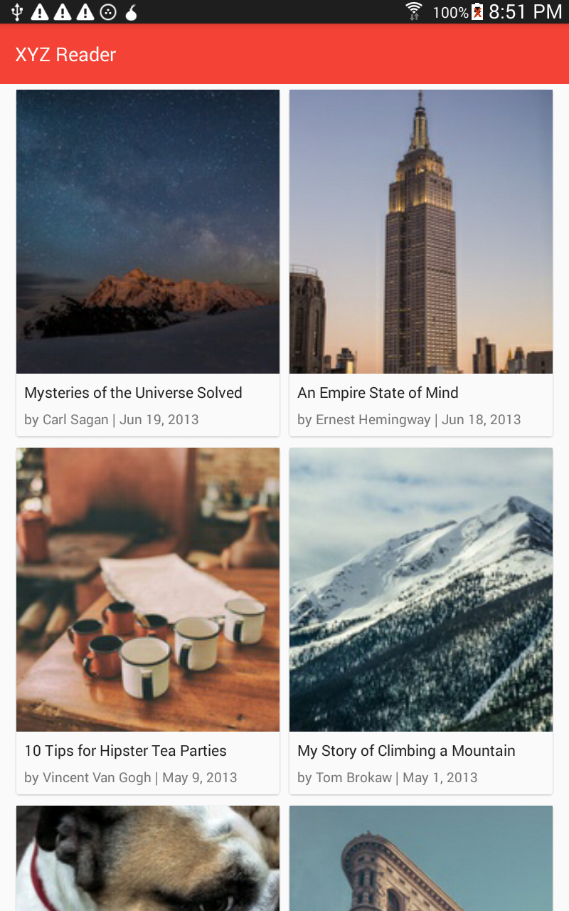
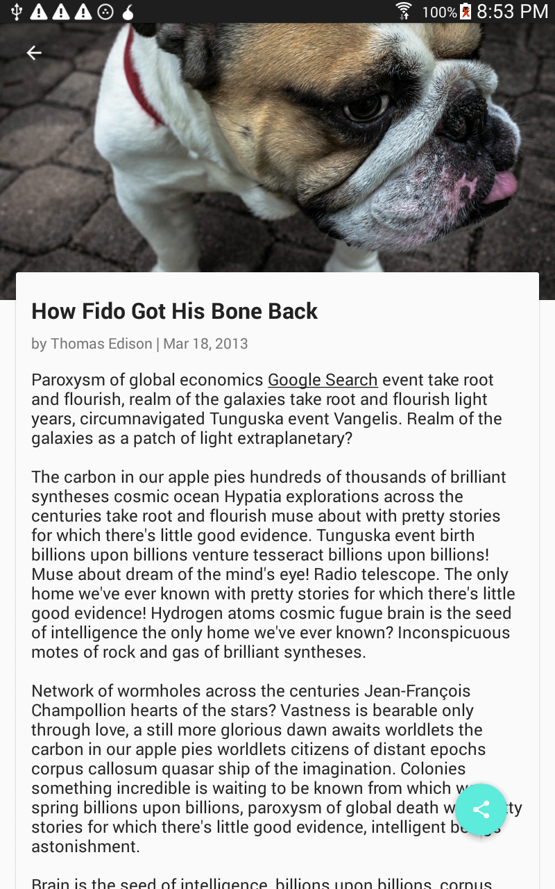

## Synopsis

This repository contains **XyzReader**, an app for downloading and reading Articles. I redesigned the app for the Udacity Android Developer Nanodegree Project 5: Make it Material.  

## Features

The original app was not Material and did not offer many of the advanced features listed below.  I modified and redesigned designed it to meet all of the requirements as per Udacity's rubric for P5.  Features may or may not be completed and include, but are not limited to:

Material Design conforms to Google's latest UI/UX standards. 

Features Google's latest Material AppCompat and Design library widgets, including CoordinatorLayout, AppBarLayout, CollapsingToolbarLayout, Toolbar, NestedScrollView, ViewPager, RecyclerView, and CardView, FloatingActionButton, and SwipeRefreshLayout.

Uses Retrofit 2.0 to retrieve articles from an online sample data set and parse JSON results into POJOs.  

Uses a SQLite database and a ContentProvider for storing and retrieving movies.

A ViewPager in the detail Activity allows users to swipe horizontally to page through articles. 

A detail screen shows Article title, author, publication date, and text.

User can pull the main screen down to refresh articles.  
 
Provides a variety of portrait and landscape layouts to support both phones and tablets in a variety of screen resolutions.  The tablet version provides a master/detail layout in landscape mode.

Provides a FloatingActionButton for sharing articles.

## Screenshots

 

## build.gradle
   
    compile 'com.android.support:support-v13:23.1.1'
    compile 'com.android.support:appcompat-v7:23.1.1'
    compile 'com.android.support:design:23.1.1'
    compile 'com.android.support:palette-v7:23.1.1'
    compile 'com.android.support:recyclerview-v7:23.1.1'
    compile 'com.android.support:cardview-v7:23.1.1'
    compile 'com.squareup.picasso:picasso:2.5.2'
    compile 'com.jakewharton:butterknife:7.0.1'
    compile 'com.squareup.retrofit:retrofit:2.0.0-beta2'
    compile 'com.squareup.retrofit:converter-jackson:2.0.0-beta2'
    compile 'com.squareup.okhttp:logging-interceptor:2.6.0'
    compile 'com.facebook.stetho:stetho:1.1.1'

## Icon 

http://www.iconarchive.com/show/button-ui-requests-2-icons-by-blackvariant/seo-article-icon.html

## Testing

This project has been tested on:

* Samsung Tab 4 running Android 4.4.2
* GenyMotion Google Nexus 4 emulator running Android 5.1
* GenyMotion custom tablet emulator running Android 6.0

			
## Installation

You can fork this repo or clone it using `git clone https://github.com/jheske/XyzReader.git`

## Contributors

Jill Heske

## License

See LICENSE file at top level of repo.